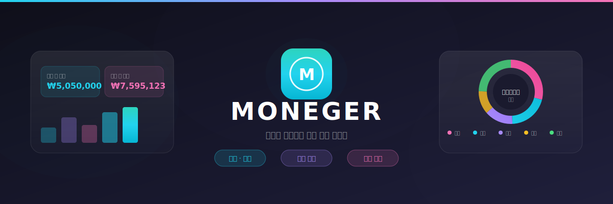

  

---

## 왜 Moneger인가요?

돈 관리가 어렵게 느껴지시나요? Moneger는 복잡한 재정 관리를 **간단하고 직관적인 경험**으로 바꿔드립니다.

- **한눈에 보는 재정 현황**: 대시보드에서 이번 달 수입, 지출, 저축을 즉시 확인
- **목표 달성 도우미**: 저축 목표를 설정하고 진행 상황을 추적
- **언제 어디서나**: 데스크톱과 모바일에서 동일한 경험 제공

---

## 주요 기능

### 대시보드

오늘의 거래 요약부터 월별 통계까지, 필요한 정보를 한 화면에서 확인하세요.

- 오늘/이번 달 수입·지출·저축 요약
- 카테고리별 지출 차트 및 전월 대비 변화 뱃지 (↗ 증가 / ↘ 감소 / 신규)
- 일별 달력 뷰로 하루하루 흐름 파악
- 월별 탐색으로 지난 달 내역 조회
- 최근 거래 내역 미리보기
- 고정비·저축·그룹·증권 자산 요약 카드
- 결제일 임박 고정비 알림 배너

### 거래 관리

수입과 지출을 빠르게 기록하고 체계적으로 관리하세요.

- 간편한 거래 추가 (수입/지출/저축)
- 날짜, 카테고리, 금액, 메모 기록
- 무한 스크롤로 모든 내역 조회
- 강력한 필터링 (기간, 금액, 카테고리, 검색어)

### 저축 목표

목표를 세우고 꾸준히 저축하는 습관을 만들어보세요.

- 저축 목표 금액 설정
- 이번 달 저축 진행률 확인
- 입금 내역 아코디언으로 N회차별 내역 확인 (날짜 · 회차 · 금액)

### 고정비 관리

월세, 구독료 같은 정기 지출을 한 곳에서 관리하세요.

- 월별 고정비 등록 및 수정
- 지출 내역 아코디언으로 N회차별 납부 기록 확인
- 이번 달 남은 고정비 합계 및 다음 결제일 표시
- 결제일 3일 이내 임박 알림

### 그룹

여행, 이사처럼 특정 목적의 지출을 묶어 관리하세요.

- 그룹 생성 및 아이콘·색상 커스터마이즈
- 그룹별 총 지출 및 거래 건수 확인
- 거래를 그룹에 태깅하여 목적별 분류

### 증권 자산 연동

토스증권과 한국투자증권 계좌를 연결해 자산 현황을 한눈에 보세요. (PRO 이상)

- 실시간 보유 종목 및 평가금액 조회
- 미실현 손익 및 당일·월간 변동 확인
- AI 포트폴리오 분석 요약 (ULTIMATE)

### 맞춤 카테고리

나만의 분류 체계로 지출을 관리하세요.

- 12가지 색상으로 카테고리 구분
- 아이콘으로 한눈에 파악
- 수입/지출 카테고리 분리

### 예산 관리

월별 예산을 설정하고 지출을 조절하세요.

- 월 예산 금액 설정
- 예산 대비 지출 현황 확인

---

## 플랜

| 기능 | FREE | PRO | ULTIMATE |
|------|:----:|:---:|:--------:|
| 거래 관리 | ✅ | ✅ | ✅ |
| 카테고리 / 예산 | ✅ | ✅ | ✅ |
| 고정비 관리 | ❌ | ✅ | ✅ |
| 저축 목표 | ❌ | ✅ | ✅ |
| 그룹 관리 | ❌ | ✅ | ✅ |
| 소비 분석 | ❌ | ✅ | ✅ |
| 자산 현황 | ❌ | ❌ | ✅ |
| 증권 자산 연동 | ❌ | ❌ | ✅ |
| AI 포트폴리오 분석 | ❌ | ❌ | ✅ |

플랜은 헤더의 플랜 뱃지에서 확인할 수 있으며, PRO·ULTIMATE 플랜은 프로필 버튼 테두리로 시각적으로 구분됩니다.

---

  Made with ❤️ for better financial management

